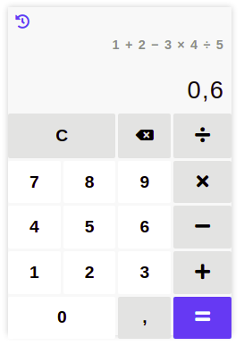
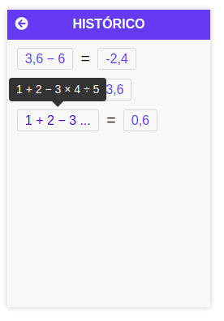

# react-calculator
**Calculadora** simples feita em React.js

**Demo:** https://joaohamerski.github.io/react-calculator/

### Todo
- Adicionar inserção de parenteses para priorizar ordem das operações
- Permitir digitação de valores negativos

## Imagens demo

